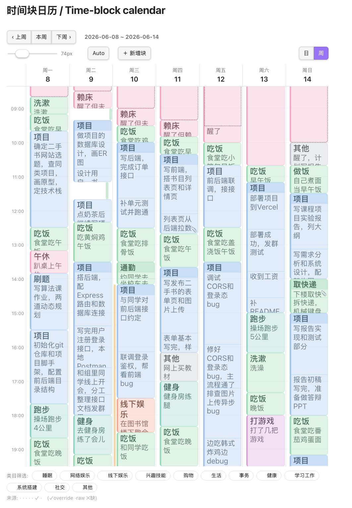
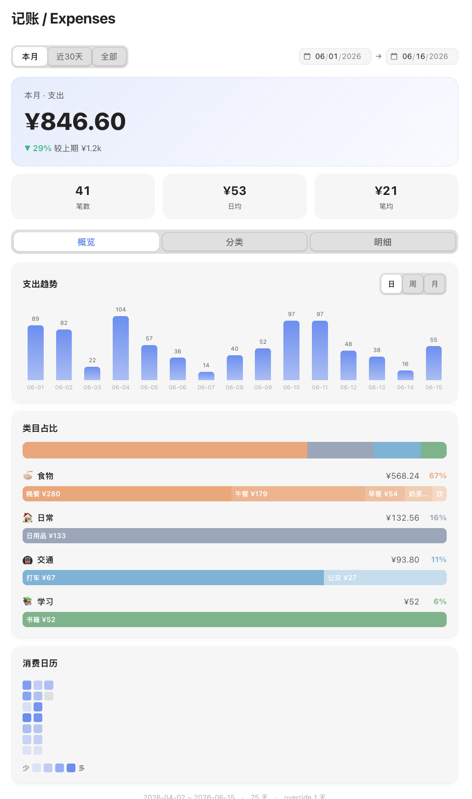

# Lifelog

> **把随手记录的纯文字，用 AI 转换成可视化的生活仪表盘。**
> Turn the plain text you jot all day into an AI-built, visual life dashboard.

一个 Obsidian 插件。你用最懒的方式记录一天——一行一个时间戳，花钱用 `**粗体**`
括起来——Lifelog 用大模型把这些笔记解析成结构化的每日数据，再渲染成
**时间块日历**和**记账仪表盘**。无需手动分类，你要做的只是自然语言描述和categories.json 自定义

<p align="center">
  
  
</p>

<p align="center">
  <a href="https://github.com/Weiraner/obsidian-lifelog/actions/workflows/ci.yml"></a>
  <a href="LICENSE"></a>
</p>

---

## 为什么做这个

大多数记录类 app 失败，是因为"记录"本身就是负担。最低成本能捕捉的，永远是
一句自然语言。这个插件希望**把录入做到尽可能笨，把所有"结构"都推到下游
交给大模型。**用户既拿到结构化数据的好处(图表、合计、时间分布)，又不用承受
手动录入结构化数据的麻烦。

## 工作原理

```
  纯文本日记                    确定性 + LLM 解析器                 结构化每日 JSON               仪表盘
  ─────────────                ────────────────────              ────────────────             ──────────
  10:48 开始写后端接口     →    LLM 判断类型并拆分活动        →    { blocks:[…],          →    时间块日历
  **22 美团 黄焖鸡午饭**         (用「条目索引」引用区间,           expenses:[…], … }           记账仪表盘
  ...                           所有时间计算都在代码里做)          (用 zod 校验)
```

解析器是**混合式**的:LLM 只做*语义*判断(这是什么活动、一天怎么拆、消费怎么
归类),并且用**条目索引**引用时间区间——它**从不自己写时间戳**。所有时间算术、
校验、词表吸附、项目归一都在纯 TypeScript 里完成,并且有测试。这就是它不会
"编造"你日程的原因。

## 功能

- **时间块日历** —— 日/周视图、重叠布局、跨夜块、后台任务、点击编辑。
- **记账仪表盘** —— 趋势、一级/二级分类占比、渠道分布、消费热力图、行内编辑,以及「＋ 记一笔」手动新增花销。
- **override 优先编辑** —— 你的修改和手动新增都写入 override 层;LLM 原始输出永不被破坏,重跑解析也不会覆盖你的手动修正。
- **多家大模型** —— 一个开关:**Claude**(原生 Messages API)+ 任意 OpenAI 兼容接口 —— **GPT / DeepSeek / MiniMax / GLM(智谱)/ 自定义**。
- **快速录入** —— 一个命令在日志末尾插入 `HH:MM:SS `;可绑快捷键。
- **用量账本** —— 每次解析把 token 用量追加到 `.lifelog/usage.jsonl`。
- **本地优先** —— 数据就是你 vault 里的纯 JSON。

## 30 秒看 demo

本仓库自带一个开箱即用的样例 vault。

1. 用 Obsidian 打开 `demo-vault/`(*打开其它库 → 选文件夹*)。
2. 提示时关掉**受限模式**(自带插件已预先启用)。
3. 打开 **`Dashboard.md`** 切到阅读视图 → 日历 + 记账面板会用样例数据渲染。
4. 看 **`journal/`** 里这些数据是从什么样的「原始日志」解析出来的。

不需要 API key —— 看板数据已提交。想重新生成:

```bash
npm install
npm run seed          # 确定性地捏造 demo 数据(不调 LLM)
```

> 其中 6 月 8–14 日这一周是用真大模型解析 `journal/` 里那周日志得到的真实结果;
> 更早的日期是 `seed` 合成的背景数据,主题一致(CS 学生日常)。

## 录入格式(你实际要打的字)

```markdown
## Raw Log
10:48:30 开始写后端接口
12:30:09 **22 美团 黄焖鸡午饭** 边吃边看文档
13:50:22 去操场跑了个步，4 公里
```

- `HH:MM:SS` 开头的行 = 一个**时间块**。
- `**金额 渠道 物品**`(粗体)= 一笔**消费**。
- 其余约定(后台任务 `>>/<<`、图片、同伴、跨夜、收入)在
  **[`demo-vault/journal/README.md`](demo-vault/journal/README.md)** 里有带示例的完整说明。

> **随手记录,不止在 Obsidian 里。** 在 Mac 上配一个「快捷指令」,就能从任何地方
> (菜单栏、全局快捷键、Siri)一句话追加到当天日记 —— 路上想到什么,说一句就记下了,
> 回头再让 Lifelog 解析。脚本和步骤见
> **[在 macOS 上用快捷指令随手记录](docs/tutorials/macos-shortcuts.md)**。

## 在你自己的 vault 里用

1. **安装**插件(见下方「安装」)并启用。
2. **配置** *设置 → Lifelog*:选 provider、填 API key、设置 **Data root** 和 **Log heading**。
3. **录入**:给*"Lifelog: Append timestamped entry to log"*绑个快捷键(设置 → 快捷键),之后自动插时间戳 + 手动打字,随手记录一整天。
4. **解析**:运行*"Lifelog: Parse current note's log"*—— 命令面板、左侧 ribbon 图标、或**设置里的按钮**都行。
5. **查看**:在任意笔记里放代码块:

````markdown
```lifelog-calendar
```

```lifelog-expense
```
````

## 配置项

| 设置 | 作用 |
|---|---|
| Provider | Claude / GPT / DeepSeek / MiniMax / GLM / 自定义 |
| API key | 存在 vault 本地的插件数据里(已被 git 忽略) |
| Model / Base URL | 可选覆盖;留空 = 用该 provider 的默认值 |
| Data root | 解析结果 JSON 存放目录(如 `.lifelog/daily`) |
| Log heading | 笔记里存放原始日志的小标题(如 `Raw Log`) |

## 教程

分步指南都在 **[`docs/tutorials/`](docs/tutorials/)** —— 包括如何从 Obsidian *之外*
往日志里录入:

- **[在 macOS 上用「快捷指令」录入](docs/tutorials/macos-shortcuts.md)** —— 从任何地方把"时间戳 + 文字"追加到当天日记(含脚本 + 截图)。
- _更多教程往这里加…_

## 架构

```
src/
├─ core/        # 纯逻辑、有测试 —— 不依赖 Obsidian、不联网
│  ├─ schema.ts   # zod 数据模型(契约)
│  ├─ parser.ts   # 条目解析、时间解析、校验、合并
│  └─ prompt.ts   # LLM 提示词(版本化、可在 diff 里 review)
├─ io/          # 副作用
│  ├─ llm-core.ts # provider 开关(纯:构造请求 / 解析响应)
│  ├─ llm.ts      # 唯一的网络调用(Obsidian requestUrl → 绕过 CORS)
│  └─ pipeline.ts # 笔记 → 提示词 → LLM → buildOutput → 写 JSON + 用量账本
├─ ui/          # 两个仪表盘(markdown 代码块处理器)
└─ main.ts      # 薄薄的 Obsidian 胶水:设置、命令、ribbon
scripts/        # seed.ts(demo 数据)、parse-journal.ts(离线批量解析)
test/           # vitest —— 用 mock 掉的 LLM 覆盖核心逻辑
demo-vault/     # 一个可直接打开的样例 vault(日志 + 仪表盘 + 数据)
```

## 开发

```bash
npm install
npm run dev          # esbuild watch
npm run build        # 类型检查 + 打包 + 同步进 demo-vault
npm test             # vitest(引擎测试,mock LLM)
npm run seed         # 重新生成 demo 看板数据
npm run parse:journal   # 离线:用真 LLM 解析 demo-vault/journal(key 通过环境变量传)
```

## 安装

**手动 / [BRAT](https://github.com/TfTHacker/obsidian42-brat):** 把 BRAT 指向本仓库,
或把 `main.js` + `manifest.json` 拷到 `<你的vault>/.obsidian/plugins/lifelog/` 后启用。
打一个带这两个文件附件的 GitHub **Release**,就是 BRAT 和手动安装读取的来源。

_(暂未进入官方社区插件商店 —— 那需要单独提交 + 过一轮 review。)_

## Roadmap

- [ ] 插件内的增量(水位)重解析 + override 同步(引擎已支持,只差接线)
- [ ] Obsidian 打开时的定时自动解析
- [ ] 用量账本里加上成本(不只是 token)
- [ ] 提交到官方社区插件商店

## 许可

[MIT](LICENSE)
