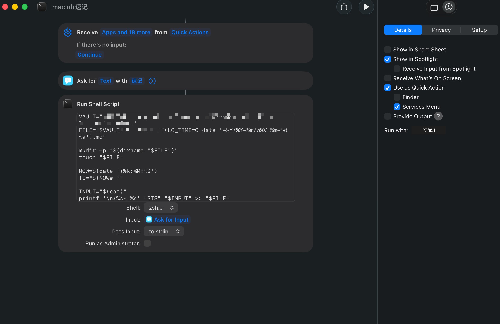

# 在 macOS 上用「快捷指令」随手记录

**目标:** 在 Mac 上从任何地方(菜单栏、全局快捷键、"嘿 Siri"、听写)说一句/打一句,
就把它作为 `时间戳 + 文字` 追加到**当天的日记**里。之后交给 Lifelog 解析即可。

之所以可行,是因为 Obsidian 库就是 iCloud 里的一堆 markdown 文件,快捷指令可以直接
往当天那篇 `.md` 追加内容——完全不用打开 Obsidian。



## 快捷指令怎么搭

1. 打开「快捷指令」App → 新建快捷指令。
2. 加一个 **「接收输入」/「要求输入」→ 文本**(或让它接收分享来的文本、听写结果)。
3. 加一个 **「运行 Shell 脚本」** 动作:
   - **Shell**: `zsh` / `bash` 都行
   - **输入**: 选择「将输入传递到 stdin」(脚本里用 `cat` 读取)
   - 粘贴下面的脚本

```bash
# 你的库路径:$HOME 已自动隐去用户名;把 YOUR_VAULT 改成你的库名
VAULT="$HOME/Library/Mobile Documents/iCloud~md~obsidian/Documents/YOUR_VAULT"

# 当天日记的路径 —— 改成你自己的日记命名规则。
# 这里的例子是「10 Journal/年/年-月/W周数 月-日 周几.md」,例如 10 Journal/2026/2026-06/W24 06-13 Sat.md
# LC_TIME=C 让 %a(周几)输出英文,避免本地化差异
FILE="$VAULT/10 Journal/$(LC_TIME=C date '+%Y/%Y-%m/W%V %m-%d %a').md"

# 当天文件不存在就创建(含上层目录)
mkdir -p "$(dirname "$FILE")"
touch "$FILE"

# 时间戳 HH:MM:SS(%k 是空格补齐的小时,下面把前导空格去掉)
NOW=$(date '+%k:%M:%S')
TS="${NOW# }"

# 从 stdin 读取快捷指令传进来的文字,追加成新的一行:*时间戳* 文字
INPUT="$(cat)"
printf '\n*%s* %s' "$TS" "$INPUT" >> "$FILE"
```

## 怎么触发

- **全局快捷键**:把快捷指令加到菜单栏 / 程序坞,或用 Raycast / Alfred / Keyboard Maestro 绑个键。
- **Siri / 听写**:"嘿 Siri,记一笔" → 直接说。
- **分享菜单**:在任意 App 选中文字 → 分享 → 这个快捷指令。

## 和解析器的配合(几个要点)

- 输出格式是 `*HH:MM:SS* 文字`(斜体时间戳)。Lifelog 的解析器认得这种**斜体/粗体包裹的时间戳**,
  会自动剥掉星号,等价于 `HH:MM:SS 文字`——所以这条能被正常解析成时间块。
- 开头的 `\n` 保证每次都另起一行,不会和上一条粘连。
- `%k:%M:%S` 的小时是单位数时会带前导空格(如 ` 9:30:05`),脚本用 `${NOW# }` 去掉它,得到 `9:30:05`;
  解析器允许个位数小时,没问题。
- 追加是写到**文件末尾**。请确保 `## Raw Log` 是日记的最后一段(这样新条目落在它下面);
  或者在插件设置里把 **Log heading 留空**,解析整篇笔记。
- 新创建的当天文件只有这些时间戳行、没有 `## Raw Log` 标题也没关系:Log heading 找不到时,
  解析器会回退为「解析整篇」。想更规整,可在脚本里于 `touch` 后补一行 `## Raw Log`。
- iCloud 同步有几秒延迟,另一台设备上的 Obsidian 不会瞬时刷新。
